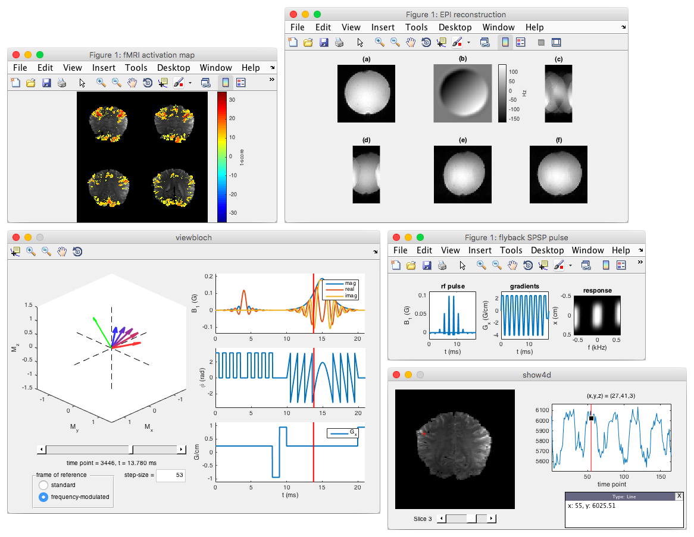

# MRI Toolbox (MRIT)

written by Haisam Islam

## About

The MRI Toolbox is a library of tools for MRI, which can be classified into the
following categories:
  
- gradient waveform generation
- RF pulse design
- image reconstruction
- data visualization
- other miscellaneous tools
  

A showcase of some of the tools found in this library.

I developed these tools during my PhD at Stanford University, but they are not
related specifically to my research. If you do work in MRI sequence development,
you may find this library useful. The tools found in the library are organized
into different folders (listed below) depending on what they do. For a more
detailed description of what is found in each folder, see the [Contents](#contents)
section.

| folder    | description                                                      |
|-----------|------------------------------------------------------------------|
| demo      | demos for various tools found in the library                     |
| disp      | tools for displaying data                                        |
| g         | tools for generating gradient waveforms                          |
| recon     | tools for reconstructing images                                  |
| rf        | tools for generating rf pulses                                   |
| util      | various utility functions                                        |

## Setup

To setup the MRIT library, run the `addpaths.m` file, which adds various folders
in the library to the matlab path. If you want this to happen automatically when
matlab starts, run it from within your matlab `startup.m` file. In matlab, run
the `setup.m` script (this only needs to be done only once, and performs
initializations such as compiling mex functions).

There are some other libraries (listed below) that may also be useful to you.
These are used by some of the tools in the MRIT library if certain options are
specified, but for the most part are not needed. All the included demos work
properly without these additional libraries.

- [rftools](https://github.com/agentmess/Spectral-Spatial-RF-Pulse-Design): 
  various tools for RF pulse design, written by
  [John Pauly](http://web.stanford.edu/~pauly).
- [MIRT](https://web.eecs.umich.edu/~fessler/irt/fessler.tgz):
  a wide range of tools for MRI, written by
  [Jeff Fessler](https://web.eecs.umich.edu/~fessler) and his group at the
  University of Michigan.

## Getting started 

After setting up the library, a good place to start is the `demo` folder, which
contains scripts that showcase the various tools found in this library. Run
these scripts and look at the contents to see how the functions are used. Refer
to the function documentation (`help <function name>`) for more details. Many of
the functions contain option arguments with default values. This avoids the
function calls from becoming overly long for common usages. The following
section [Notes on arguments](#notes-on-arguments) covers how optional
arguments are passed, as well as how argument information is formatted in the
documentation.

## Notes on arguments

### Optional arguments
Optional arguments are specified after the required arguments. Each optional
argument specified requires two additional arguments to be passed: the name of
the argument (passed as a `string`) and its value. For example, to add an
overlay image in the `imdisp` function, the function call would be:
`imdisp(uim, 'o', oim)`, where `uim` and `oim` are the underlay and overlay
images, respectively.

### Documentation

The docmentation for each function lists the input and output arguments for that
function. Required arguments are listed under `inputs`, optional arguments under
`options`, and output arguments under `outputs`. Various pieces of information
for each argument is also given. These include:

| information     | examples                                                   |
|-----------------|------------------------------------------------------------|
| data structure  | `scalar`, `vector`, `array`, `struct`                      |
| data type       | `int`, `float`, `complex`, `string`, `logical`             |
| data units      | `cm`, `ms`, `G`, `G/cm`                                    |
| discrete values | `0` or `1` (for binary arguments)                          |

Not all of these pieces of information need to be specified, and in most cases,
some pieces of information can be assumed based on others. Usually, if the data
units are specified, the data type is `float`, or if the data type (or data
units) is specified, the data structure is `scalar`. If the data type is not
given, it is usually assumed to be `float`.

#### Arrays
An `array` is indicated by square brackets (`[]`). Inside the brackets, the
array dimensions are listed. For example, the array `[x y time]` contains 3
dimensions: `x`, `y`, and `time`. In some cases, the size of a particular
dimension is specified in `{}` next to that dimension. For example,
`[x y{#x/2} time{4}]` indicates that the size of the `y` dimension is 1/2
that of the `x` dimension (the `#` indicates "size of"), and the `time`
dimension has size 4. A given dimension may be detailed in parentheses `()`,
with the values along the dimension listed out. For example,
`[x y (red,green,blue)]` is a 3-D array, with the third dimension containing
`red`, `green`, and `blue` color values.

In some cases, the array may contain an arbitrary number of additional
dimensions. This is indicated by an ellipsis `...` following the required
dimensions. For example, the array `[x y ...]` can contain any number of
dimensions after the `x` and `y` dimensions. If the array can contain *any*
number of dimensions, it may be written as `N-D array` (instead of `[...]`).

#### Vectors
If the data is a vector, i.e. a 1-D array, it is simply called `vector`.
If the vector needs to be a particular length, it is called `N-vector`, where
`N` is the length, e.g. a vector of length 2 is called a `2-vector`. In matlab,
vectors are stored as `1 x N` or `N x 1` matrices. Either one can be used.

#### Units
The data type or data units are indicated in `()`. If the data structure is
`scalar`, `vector`, or `array`, and the data type is not specified, it is
assumed to be `float`.

#### Discrete valued arguments
Sometimes, an argument can take only one of a list of values. In such cases,
these values are given inside angle brackets (`<>`). For example, `<0, 1>`
indicates that the argument value can be either `0` or `1`. Often, the meanings
of these values are clear from the context (e.g. often `0` means `false` or
'no', while `1` means `true` or 'yes'). If not, the values and their meanings
are described in the following lines. For example, if a plotting function has
an argument `plottype` which specifies how to plot complex data, i.e. as either
real and imaginary or magnitude and phase, this may be indicated with:
```
'ri' : plots real and imaginary values
'mp' : plot magnitude and phase
```

### Contents

The following sections list each folder in the MRIT library and some of the
functions found inside the folder. Smaller functions (mostly utility functions)
are not listed here.

--------------------------------------------------------------------------------

**demo** : contains demos for various functions in the library

`go_fmri`  
processes fMRI data using a general linear model, and displays the activation
maps.

`go_hs`  
designs an adiabatic hyperbolic-secant RF pulse, plots the response, and
displays the Bloch evolution of the magnetization.

`go_pi`  
takes multichannel DFT data, undersamples it, and reconstructs it using GRAPPA
and SENSE.

`go_reconepi`  
reconstructs EPI data from a uniform agar phantom.

`go_reconepilg`  
reconstructs EPI data from an agar phantom with a large off-resonance gradient
across it. There are many options for the reconstruction: acceleration factor
(GRAPPA or SENSE), Nyquist ghost correction method, field map correction. If
GRAPPA is used, there are other options that can be specified.

`go_rfepi`  
generates an EPI RF pulse for exciting a rectangular region of a given size with
a given selectivity, and displays the response.

`go_spsp`  
generates spatial-spectral RF pulses (flyback and no flyback) and displays the
responses.

--------------------------------------------------------------------------------

**disp** : tools for visualizing data

`cycplot`  
allows you to cycle through multiple plots with the arrow keys.

`imdisp`  
displays an N-D array of slices, where the first two dimensions contain the
slices (similar to matlab's 'montage').

`mplot`  
like matlab's 'plot', but allows you to specify multiple plot properties in one
line, and has (in my opinion) better defaults.

`show4d`  
displays 4-D data (x, y, z, time) in an interactive GUI. useful for visualizing
e.g. fMRI data.

--------------------------------------------------------------------------------

**fmri** : tools for analyzing fmri data

`hrf.mat`  
contains a canonical hemodynamic response function.

`bdcov`  
creates a block-design stimulus covariate.

`cstat`  
converts between p-values, correlation values, and t-scores,accounting for the
auto-correlation of the hemodynamic responsefunction.

`glm`  
performs a general linear model, with inputs for stimulus and nuisance
covariates, with polynomial detrending.

`pfilt`  
uses an adaptive low-pass filter to improve the SNR, but uses the local standard
deviation to preserve edges.

`tsdf`  
computes the effective # degrees of freedom in a time-series, accounting for the
auto-correlation of the hemodynamic response function.

--------------------------------------------------------------------------------

**g** : tools related to gradient design

`gepi`  
generates an EPI trajectory.

`gtrap`  
generates a trapezoid, with options to minimize the length for a given area,
maximize the area for a given length, or create a trapezoid with a given length
and area.

--------------------------------------------------------------------------------

**recon** : tools for reconstructing mri data

`cbo`  
calculates the B0 field map using two complex images at different echo times.
this is fast, but doesn't produce the cleanest maps - the
`mri_sensemap_denoise` function in the MIRT toolbox works much better.

`epifmc`  
performs time-segmented field-map correction on EPI data - requires a B0 field map.

`grap2coef`  
computes 2D GRAPPA coefficients using a fully sampled region of k-space and a
kernel mask.

`grap2dft`  
fills in missing lines of k-space using GRAPPA.

`grap2fill`  
fills in missing 2D k-space entries using GRAPPA coefficients.

`repi`  
reconstructs ramp-sampled EPI data, performing phase correction using a
reference scan, with options for GRAPPA.

`sense`  
performs a SENSE reconstruction.

--------------------------------------------------------------------------------

**rf** : tools related to rf pulse design

`bloch`  
simulates the response to an RF pulse and set of gradients, with support for up
to 3 gradient axes.

`getfa`  
gets flip angle for a complex RF pulse.

`rfepi`  
generates a 2D EPI RF pulse for exciting a rectangular region.

`rfhs`  
generates a hyperbolic-secant RF pulse.

`spsp`  
generates a spatial-spectral RF pulse.

`verse`  
reshapes an RF pulse based on the applied gradient so that the deposited B1
weighting matches the original RF pulse. 

`viewbloch`  
allows you to visualize the evolution of the magnetization as the RF pulse and
gradients are applied.

`viewslpr`  
handy tool to visualize overlap of adjacent slices with a given slice thickness,
spacing, and time-bandwidth of a given slice-select RF pulse.

`wsinc`  
generates a hamming-weighted sinc RF pulse.

--------------------------------------------------------------------------------

**util** : various utility functions

`ccfilt2`  
convenience tool for filtering connected components.

`fwhm`  
computes the full-width at half-max and offset of a curve.

`mask`  
generates a mask based on the intensity histogram.

`nufft{1,2}`  
a non-uniform FFT in (1 or 2) dimensions (for reconstructing data not sampled on
a grid).

`pfit`  
computes polynomial fit coefficients (has some extra features over matlab's
'polyfit').

`setopts`  
useful tool for setting default values for arguments.

### Additional notes

The MRIT library was written in matlab R2015b, so there may be things that don't
work properly in other versions of matlab. The libary is licensed by the
[MIT License](LICENSE.md), so feel free to copy and modify it.

